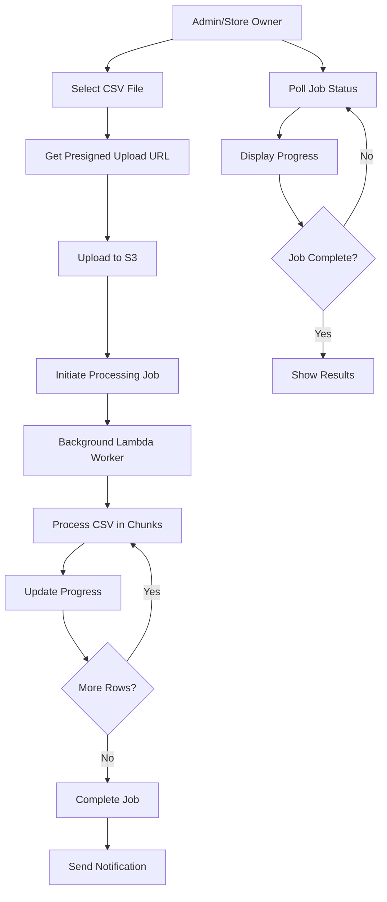

# VyapaarAI Async Import System Documentation

## Overview

The VyapaarAI Async Import System is a production-ready, scalable solution for bulk importing products and inventory data. It replaces the previous synchronous import system with an asynchronous, job-based architecture that can handle large CSV files without Lambda timeout issues.

## Architecture

### High-Level Flow



### Key Components

1. **Frontend (React/TypeScript)**
   - File upload with progress tracking
   - Real-time job status polling
   - Error report download
   - CSV template generation

2. **Backend API Endpoints**
   - `GET /api/v1/admin/products/import/upload-url` - Get presigned S3 upload URL
   - `POST /api/v1/admin/products/import/process` - Initiate processing job
   - `GET /api/v1/admin/products/import/{job_id}/status` - Poll job status

3. **Background Processing Worker**
   - Chunked CSV processing
   - Checkpoint/resume capability
   - Image processing pipeline
   - Error tracking and reporting

4. **Data Storage**
   - S3 buckets for CSV files and images
   - DynamoDB for job tracking
   - Enhanced GSIs for efficient deduplication

## Infrastructure

### S3 Buckets

#### `vyapaarai-bulk-uploads-prod`
- **Purpose**: Store uploaded CSV files
- **Lifecycle**: 30-day retention
- **Structure**: `admin-imports/{job_id}/input.csv`

#### `vyapaarai-product-images-prod`
- **Purpose**: Store processed product images
- **Structure**: `{product_id}/{size}.jpg`
- **Sizes**: original, medium (800px), thumbnail (200px)

### DynamoDB Tables

#### `vyaparai-import-jobs-prod`
```json
{
  "job_id": "admin_import_20250106_abc123",
  "job_type": "admin_product_import",
  "status": "processing",
  "progress": {
    "total_rows": 2000,
    "processed_rows": 1500,
    "successful": 1450,
    "duplicates": 30,
    "errors": 20
  },
  "s3_bucket": "vyapaarai-bulk-uploads-prod",
  "s3_input_key": "admin-imports/job_id/input.csv",
  "created_at": "2025-01-06T10:30:00Z",
  "ttl": 1736184000
}
```

**GSIs:**
- `created_by_user_id_gsi` + `created_at_gsi` - User's recent jobs
- `status_gsi` + `created_at_gsi` - Jobs by status
- `job_type_gsi` + `created_at_gsi` - Jobs by type

#### Enhanced Global Products Table
**New GSI:** `name-brand-index`
- **PK**: `name_brand_key` (normalized: "nestle#maggi2minutenoodles")
- **SK**: `product_id`

## API Endpoints

### 1. Get Presigned Upload URL

```http
GET /api/v1/admin/products/import/upload-url?filename=products.csv
```

**Response:**
```json
{
  "success": true,
  "upload_url": "https://s3.amazonaws.com/...",
  "job_id": "admin_import_20250106_abc123",
  "s3_key": "admin-imports/admin_import_20250106_abc123/input.csv",
  "expires_in": 600
}
```

### 2. Initiate Processing

```http
POST /api/v1/admin/products/import/process
Content-Type: application/json

{
  "job_id": "admin_import_20250106_abc123"
}
```

**Response:**
```json
{
  "success": true,
  "job_id": "admin_import_20250106_abc123",
  "status": "queued",
  "estimated_rows": 2000,
  "message": "Import job queued for processing"
}
```

### 3. Poll Job Status

```http
GET /api/v1/admin/products/import/{job_id}/status
```

**Response:**
```json
{
  "success": true,
  "job_id": "admin_import_20250106_abc123",
  "status": "processing",
  "progress": {
    "total_rows": 2000,
    "processed_rows": 1500,
    "successful": 1450,
    "duplicates": 30,
    "errors": 20,
    "percentage": 75.0
  },
  "timestamps": {
    "created_at": "2025-01-06T10:30:00Z",
    "started_at": "2025-01-06T10:30:05Z",
    "estimated_completion": "2025-01-06T10:35:00Z"
  },
  "error_report_url": "https://s3.amazonaws.com/.../errors.csv",
  "recent_errors": [
    {
      "row_number": 45,
      "barcode": "1234567890",
      "name": "Product X",
      "error_message": "Barcode must be 8-13 digits"
    }
  ]
}
```

## CSV Format

### Required Headers
- `name` - Product name
- `category` - Product category

### Optional Headers
- `brand` - Product brand
- `barcode` - Primary barcode
- `description` - Product description
- `image_url_1` to `image_url_10` - Image URLs (up to 10)
- `size`, `unit`, `weight`, `pack_size` - Physical attributes
- `manufacturer`, `country_of_origin`, `ingredients` - Manufacturing info
- `nutrition_*` - Nutrition information
- `regional_names_*` - Regional language names

### Example CSV
```csv
name,category,brand,barcode,description,image_url_1,image_url_2,weight,manufacturer,regional_names_IN-MH,regional_names_IN-TN
"Basmati Rice 1kg","Rice & Grains","India Gate","8901030875391","Premium aged basmati rice","https://example.com/basmati1.jpg","https://example.com/basmati2.jpg","1kg","India Gate Foods","बासमती चावल 1kg","பாஸ்மதி அரிசி 1kg"
```

## Processing Logic

### 1. Deduplication Strategy
1. **Barcode Match** (Primary) - Query `barcode-index` GSI
2. **Image Hash Match** - Query `image_hash-index` GSI  
3. **Name+Brand Match** - Query `name-brand-index` GSI (NEW)

### 2. Image Processing Pipeline
1. Download images from URLs
2. Compute perceptual hash for deduplication
3. Generate thumbnails (original, medium, small)
4. Upload to S3 with organized structure
5. Update product with S3 URLs

### 3. Quality Scoring
- **Basic Info** (30 points): name, brand, category
- **Barcode** (20 points): primary barcode
- **Images** (20 points): canonical image URLs
- **Attributes** (30 points): description, weight, size, etc.

### 4. Error Handling
- Per-row validation with detailed error messages
- Error report CSV with original data + error details
- Recent errors displayed in real-time
- Graceful handling of malformed data

## Frontend Implementation

### Key Features
- **Direct S3 Upload**: No Lambda payload limits
- **Real-time Progress**: Polling every 2 seconds
- **Error Preview**: Show recent errors during processing
- **Template Download**: Generate CSV template with all fields
- **Error Report**: Download detailed error CSV

### Component Structure
```typescript
AdminGlobalImportDialog
├── File Selection
├── Upload Progress
├── Job Status Display
│   ├── Progress Bar
│   ├── Statistics Grid
│   ├── Recent Errors
│   └── Error Report Download
└── Completion Messages
```

## Deployment

### Prerequisites
- AWS CLI configured
- Python 3.9+
- Node.js 18+ (for frontend)

### Infrastructure Setup
```bash
# Run deployment script
./deploy_async_import.sh
```

This script creates:
- S3 buckets with lifecycle policies
- DynamoDB tables with GSIs
- Lambda functions with proper IAM roles
- CloudWatch alarms for monitoring

### Environment Variables
```bash
GLOBAL_PRODUCTS_TABLE=vyaparai-global-products-prod
STORE_INVENTORY_TABLE=vyaparai-store-inventory-prod
BULK_UPLOADS_BUCKET=vyapaarai-bulk-uploads-prod
PRODUCT_IMAGES_BUCKET=vyapaarai-product-images-prod
```

## Monitoring and Alerting

### CloudWatch Alarms
- **Lambda Duration**: Alert if processing takes >10 minutes
- **Error Rate**: Alert if error rate >5%
- **Job Failures**: Alert on job status = "failed"

### Logging
- Job creation and status updates
- Processing progress and errors
- Image processing results
- Performance metrics

## Performance Characteristics

### Scalability
- **File Size**: Up to 5GB CSV files
- **Row Count**: 100,000+ products per import
- **Concurrent Jobs**: Multiple imports simultaneously
- **Checkpoint/Resume**: Handles Lambda timeouts gracefully

### Performance Metrics
- **Processing Speed**: ~100-200 rows/minute (with image processing)
- **Memory Usage**: 512MB-1GB Lambda memory
- **Timeout Handling**: Checkpoint every 30 seconds remaining
- **Deduplication**: GSI-based, no expensive scans

## Security

### Access Control
- JWT-based authentication for all endpoints
- Role-based access (admin/super_admin)
- S3 presigned URLs with 10-minute expiration
- Job ownership verification

### Data Protection
- CSV files stored in private S3 buckets
- Images processed and stored securely
- Error reports contain sanitized data
- TTL-based automatic cleanup

## Migration from Legacy System

### Phase 1: Parallel Deployment
- Deploy new async system alongside existing
- Update frontend to use new endpoints
- Monitor both systems for 2 weeks

### Phase 2: Gradual Migration
- Route new imports to async system
- Keep legacy endpoint for backward compatibility
- Monitor performance and error rates

### Phase 3: Legacy Deprecation
- Mark legacy endpoint as deprecated
- Remove legacy code after 30 days
- Complete migration to async system

## Troubleshooting

### Common Issues

#### 1. Upload Failures
- **Cause**: S3 permissions or network issues
- **Solution**: Check IAM roles and network connectivity

#### 2. Processing Timeouts
- **Cause**: Large files exceeding Lambda limits
- **Solution**: Checkpoint/resume automatically handles this

#### 3. Image Processing Failures
- **Cause**: Invalid URLs or network issues
- **Solution**: Images are optional; processing continues

#### 4. Deduplication Issues
- **Cause**: Missing GSI or data inconsistencies
- **Solution**: Verify GSI exists and data is normalized

### Debugging Steps
1. Check CloudWatch logs for Lambda errors
2. Verify DynamoDB job records
3. Test S3 bucket access and permissions
4. Validate CSV format and required headers
5. Check image URLs are accessible

## Future Enhancements

### Planned Features
- **SNS Notifications**: Email alerts on job completion
- **Batch Operations**: Process multiple files simultaneously
- **Advanced Matching**: Fuzzy string matching for names
- **Data Validation**: Schema validation with custom rules
- **Analytics Dashboard**: Import statistics and trends

### Performance Optimizations
- **Parallel Processing**: Multiple Lambda workers
- **Caching**: Redis for frequently accessed data
- **Compression**: Gzip CSV files for faster uploads
- **Streaming**: Process CSV without loading entire file

## Support and Maintenance

### Regular Tasks
- Monitor job failure rates
- Clean up old job records (TTL handles this)
- Update image processing libraries
- Review and optimize performance

### Backup and Recovery
- S3 versioning enabled for all buckets
- DynamoDB point-in-time recovery
- Cross-region replication for critical data
- Regular backup testing

---

## Quick Start Guide

1. **Deploy Infrastructure**
   ```bash
   ./deploy_async_import.sh
   ```

2. **Update Frontend**
   - Replace `AdminGlobalImportDialog.tsx` with new async version
   - Test file upload and progress tracking

3. **Test Import Flow**
   - Download CSV template
   - Upload test CSV file
   - Monitor job progress
   - Verify results in database

4. **Monitor System**
   - Check CloudWatch logs
   - Verify job completion rates
   - Test error handling scenarios

The async import system provides a robust, scalable solution for bulk data imports while maintaining data quality and providing excellent user experience through real-time progress tracking and detailed error reporting.
